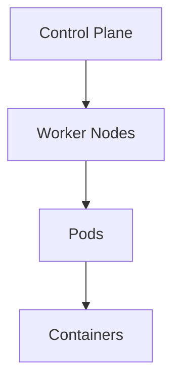

# Kubernetes Architecture

Understanding Kubernetes architecture is crucial for effectively working with the platform. This section explains the key components and how they work together.

## Cluster Architecture

A Kubernetes cluster consists of two main parts:
1. **Control Plane** (Master Nodes)
2. **Worker Nodes**

## Control Plane Components

### 1. API Server
- Central management point
- Exposes Kubernetes API
- Validates and processes requests
- Maintains cluster state

### 2. Scheduler
- Assigns pods to nodes
- Considers resource requirements
- Handles constraints and affinity
- Optimizes resource utilization

### 3. Controller Manager
- Runs core control loops
- Watches shared state
- Makes changes to move current state to desired state
- Includes:
  - Node Controller
  - Replication Controller
  - Endpoints Controller
  - Service Account Controller

### 4. etcd
- Consistent and highly-available key-value store
- Stores cluster state
- Configuration data
- Service discovery information

## Node Components

### 1. Kubelet
- Primary node agent
- Manages pod lifecycle
- Ensures containers are running
- Reports node status

### 2. Container Runtime
- Runs containers
- Supports multiple runtimes (Docker, containerd, CRI-O)
- Handles container operations
- Manages container images

### 3. Kube-proxy
- Network proxy
- Maintains network rules
- Enables service discovery
- Handles load balancing

## Add-ons

### 1. DNS
- Cluster DNS server
- Service discovery
- Name resolution

### 2. Dashboard
- Web-based UI
- Cluster management
- Monitoring

### 3. Container Resource Monitoring
- Metrics collection
- Performance monitoring
- Resource usage tracking

## Communication Flow

1. User submits request to API Server
2. API Server validates request
3. Scheduler assigns pods to nodes
4. Kubelet on nodes creates containers
5. Controllers maintain desired state

## High Availability

For production environments:
- Multiple control plane nodes
- Load balanced API servers
- Replicated etcd
- Multiple worker nodes

## Security Considerations

- Role-Based Access Control (RBAC)
- Network Policies
- Pod Security Policies
- Secrets Management

## Next Steps

Now that you understand the architecture, learn about [Core Concepts](../core-concepts/pods.md) to start working with Kubernetes. 